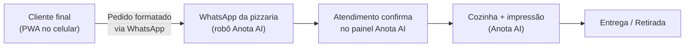

# Guia de integração — PWA Gringo Pizzaria + Anota AI

Este guia documenta, passo a passo, como colocar este PWA no ar **substituindo o
cardápio digital que a Anota AI fornece ao cliente final**, mantendo todo o resto do
sistema da Anota AI funcionando como está: robô de atendimento no WhatsApp, painel
de pedidos, cozinha, impressão e entrega.

> **Importante:** o PWA não processa pagamentos. O cliente final apenas informa como
> pretende pagar (Pix, cartão ou dinheiro) e o acerto acontece na entrega/retirada,
> exatamente como já acontece hoje.

---

## Como a integração funciona



1. O cliente acessa o PWA (ou instala na tela inicial), monta o pedido e confirma.
2. O app abre o WhatsApp do próprio cliente com o pedido completo já formatado
   (itens, observações, endereço, forma de pagamento e total), endereçado ao número
   da pizzaria — o mesmo número atendido pelo robô da Anota AI.
3. O pedido chega como mensagem no atendimento. A equipe confirma e lança no painel
   da Anota AI, e o fluxo segue normal: cozinha, impressão, entrega.

**O que muda:** apenas a "vitrine" (o link de cardápio que o cliente final abre).
**O que não muda:** nada na operação da Anota AI.

---

## Pré-requisitos

- [ ] Acesso ao painel administrativo da Anota AI do cliente.
- [ ] Número de WhatsApp da pizzaria (o atendido pelo robô da Anota AI).
- [ ] Uma hospedagem estática com HTTPS (GitHub Pages, Vercel, Netlify ou
      Cloudflare Pages — todas têm plano gratuito que atende).
- [ ] Opcional: um domínio próprio (ex.: `pedido.gringopizzaria.com.br`).

---

## Passo 1 — Configurar o app (`config.js`)

Edite o arquivo `config.js` na raiz do projeto:

```js
window.GRINGO_CONFIG = {
  // OBRIGATÓRIO: 55 + DDD + número, só dígitos.
  // É para este número que os pedidos serão enviados.
  whatsapp: "5511999999999",

  // Hub de pedidos (n8n) — registro do pedido e status real.
  // Já configurado; deixe "" em ambos para desativar o hub e voltar
  // ao modo somente-WhatsApp com estimativa por tempo.
  webhookPedidos: "https://n8n.fluxo-royale.com.br/webhook/gringo/pedido",
  statusUrl: "https://n8n.fluxo-royale.com.br/webhook/gringo/status",

  // Taxa de entrega em reais.
  taxaEntrega: 7,

  // Tempos médios (minutos) usados como FALLBACK quando o hub está
  // desativado ou o pedido não chegou a ser registrado nele.
  etaMinutos: { preparando: 5, saiu: 25, entregue: 40 },
};
```

Sem o `whatsapp` preenchido o pedido não é enviado a lugar nenhum — este passo é o
único obrigatório no código.

## Passo 2 — Conferir o cardápio e os dados da loja

Tudo que o cliente final vê está em `index.html`, nas constantes no início do
script da aplicação. Confira com o dono da pizzaria antes de publicar:

| O que conferir | Onde está |
|---|---|
| Sabores, ingredientes e **preços** (por linha e tamanho) | constante `SABORES` |
| Linhas (Sem Borda / Com Borda / Premium) e recheios | `LINHAS`, `RECHEIOS`, `PREMIOS` |
| Taxa de entrega | `config.js` (`taxaEntrega`) |
| **Desconto de 10% no Pix** (regra ativa no app!) | busque `subtotal * 0.1` |
| Horário de funcionamento (hoje: qua–seg, 18h–23h, fechado terça) | busque `aberto` e `horarioTexto` |
| Endereço exibido (hoje: Rua Professor Sud Menucci, 499-A) | busque `localTexto` |
| Fotos das pizzas | pasta `assets/` |

## Passo 3 — Publicar o PWA

O projeto é 100% estático: **não tem build nem backend**. Basta servir a pasta.

**Opção A — GitHub Pages (grátis, direto deste repositório):**
1. Faça o merge do pull request para a branch `main`.
2. No GitHub: *Settings → Pages → Deploy from a branch → main / (root)*.
3. A URL será `https://<usuario>.github.io/GringoPizzaria-Front/`.

**Opção B — Vercel / Netlify / Cloudflare Pages:**
1. Importe o repositório no serviço.
2. Framework: **nenhum**; comando de build: **nenhum**; pasta de saída: raiz (`.`).
3. Opcional: aponte um domínio próprio (ex.: `pedido.gringopizzaria.com.br`).

Requisitos que a hospedagem já resolve sozinha:
- **HTTPS é obrigatório** — sem ele o PWA não instala e o service worker não roda.
- Teste local, se quiser: `python3 -m http.server 8000` e abra `http://localhost:8000`.

Após qualquer atualização publicada, **aumente `CACHE_VERSION` no `sw.js`**
(ex.: `v1` → `v2`) para que os celulares dos clientes baixem a versão nova.

## Passo 4 — Substituir a página da Anota AI pelo PWA

Este é o passo que efetivamente "troca a vitrine". O link do PWA precisa entrar em
todos os lugares onde hoje o cliente recebe o link do cardápio da Anota AI:

1. **Robô da Anota AI (principal):** no painel da Anota AI, edite as mensagens
   automáticas do robô (saudação / envio de cardápio) para enviarem o link do PWA
   no lugar do link `pedido.anota.ai/...`. O caminho exato varia conforme o plano,
   mas fica nas configurações de atendimento/mensagens do robô. Se a opção não
   aparecer no painel do cliente, peça ao suporte da Anota AI para personalizar a
   mensagem de cardápio.
2. **Bio do Instagram** da pizzaria.
3. **Google Meu Negócio** (botão "Fazer pedido" / site).
4. **QR codes** de mesa, balcão, panfletos e embalagens — gere novos apontando para
   o PWA.
5. **Catálogo/recados no próprio WhatsApp Business**, se houver link fixado.

## Passo 5 — Ajustar o robô para receber os pedidos

O pedido chega ao WhatsApp como uma mensagem começando com
`*NOVO PEDIDO — Gringo Pizzaria*`. Configure o comportamento do robô para esse caso:

- O ideal é o robô **transferir para atendimento humano** quando receber uma
  mensagem nesse formato (em vez de tentar interpretá-la como conversa).
  Na Anota AI isso se configura nas regras de transbordo/atendimento humano do robô.
- Alinhe com a equipe: ao receber o pedido, **confirmar com o cliente e lançar no
  painel da Anota AI** como já fazem com pedidos que chegam por WhatsApp. A partir
  daí cozinha e impressão seguem o fluxo normal.

## Passo 6 — Teste de ponta a ponta (checklist de go-live)

Faça um pedido real de teste, do celular, antes de divulgar:

- [ ] O PWA abre pela URL publicada e oferece "Adicionar à tela inicial".
- [ ] Instalado, abre em tela cheia com o ícone da pizzaria.
- [ ] Montar uma pizza (2 sabores, borda, observação) e finalizar o pedido.
- [ ] O WhatsApp abriu com a mensagem completa e endereçada ao número certo.
- [ ] O robô da Anota AI recebeu e transferiu para humano (não "conversou" com o pedido).
- [ ] A equipe conseguiu lançar o pedido no painel da Anota AI e ele saiu na cozinha/impressora.
- [ ] Repetir o teste na opção **Retirada** e com cada forma de pagamento.
- [ ] Modo avião depois do primeiro acesso: o cardápio ainda abre (offline OK).

---

## Operação diária (resumo para a equipe)

1. Chegou mensagem `NOVO PEDIDO` no WhatsApp → confirmar com o cliente.
2. Lançar o pedido no painel da Anota AI (como qualquer pedido de WhatsApp).
3. Cozinha, impressão e entrega: tudo igual a hoje.
4. Pagamento: na entrega/retirada, conforme o cliente informou na mensagem.
   **O app não cobra nada.**

## Limitações conhecidas

- O acompanhamento no app usa o **status real marcado no Painel de Pedidos**
  (ver seção do hub abaixo) para pedidos registrados no hub, com consulta a cada
  15 s. Se o hub estiver desativado ou o registro falhar, o app cai no fallback
  de **estimativa por tempo** (`etaMinutos` no `config.js`). O "Entregue" também
  pode ser confirmado pelo próprio cliente no app.
- O painel ainda não conversa sozinho com a Anota AI: a equipe precisa tocar em
  "Aprovar" no painel quando confirmar o pedido no Anota AI. A sincronização
  automática exige a API de parceiros (ver fim da seção do hub).
- O envio depende de o cliente concluir o envio da mensagem que o app abre no
  WhatsApp dele. Se ele fechar sem enviar, o pedido não chega (o app mantém o
  pedido na tela "Pedidos" do cliente, mas a pizzaria não recebe).

## Hub de pedidos (n8n) — status real no app do cliente

Já está **construído, publicado e ativo** no n8n (workflow "Gringo Pizzaria — Hub
de Pedidos", `https://n8n.fluxo-royale.com.br/workflow/WvNMPLVlNU1m43ds`), com os
pedidos guardados na data table `gringo_pedidos`. Como funciona:

1. Ao confirmar, o PWA **registra o pedido no hub** (`webhookPedidos`) além de
   abrir o WhatsApp — os dois caminhos funcionam em paralelo.
2. A equipe acompanha e atualiza os pedidos no **Painel de Pedidos** (link abaixo):
   ao confirmar o pedido no Anota AI, toca em **"Aprovar (em preparo)"**; depois
   **"Saiu p/ entrega"** e **"Marcar entregue"** (ou **"Cancelar"**).
3. O app do cliente consulta o status a cada 15 s (`statusUrl`) e move a linha do
   tempo com o **status real** — nada de estimativa.

### Endereços do hub

| O quê | URL |
|---|---|
| Painel de Pedidos (equipe) | `https://n8n.fluxo-royale.com.br/webhook/gringo/painel` |
| Registrar pedido (usado pelo PWA) | `POST .../webhook/gringo/pedido` |
| Consultar status (usado pelo PWA) | `GET .../webhook/gringo/status?id=<id>` |
| Atualizar status (usado pelo painel) | `POST .../webhook/gringo/atualizar` |

O painel pede uma **senha** no primeiro acesso (o "segredo" que autoriza mudanças
de status). O valor atual é `gringo-status-x7k9m3p2` — está definido nos nós
"Autorizado?" e "Painel Autorizado?" do workflow; **troque-o antes de passar o
painel para a equipe** e informe o novo valor só a quem opera os pedidos.
Salve o link do painel na tela inicial do celular/tablet do balcão.

### Evolução futura — sincronizar sozinho com a Anota AI

Hoje a aprovação é um toque no painel. Para o status mudar sozinho quando a
equipe mexer no painel da própria Anota AI, o cliente precisa solicitar ao
suporte da Anota AI o acesso à **API de parceiros** (token). Com o token em
mãos, basta acrescentar ao workflow do hub um fluxo que consulta a API e chama
o endpoint `atualizar` — o PWA e o painel continuam exatamente como estão.

---

## Referência rápida de arquivos

| Arquivo | Para que serve |
|---|---|
| `config.js` | WhatsApp, webhook opcional e taxa de entrega — **único arquivo que precisa editar** |
| `index.html` | App completo (cardápio, preços, montador, carrinho, checkout, acompanhamento) |
| `sw.js` | Service worker — suba `CACHE_VERSION` a cada deploy |
| `manifest.webmanifest` + `icons/` | Identidade do app instalado |
| `assets/`, `fonts/`, `vendor/` | Fotos, vídeo, fontes e React locais (sem CDN) |
